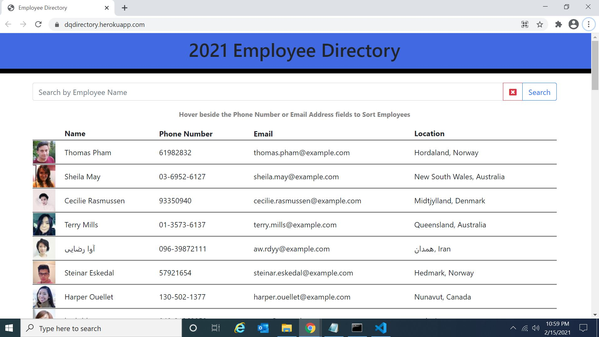
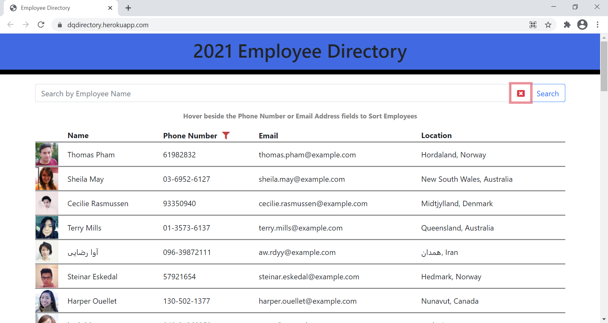

# employeedirectory

## Table of Contents
* [Description](#description)
* [Installation](#installation)
* [Usage](#usage)

## Description 
This application allows users view their entire employee directory at once so they have quick access to their information.
 
  

Screenshot Showing Searching by Employee Name:
  

Screenshot Showing Filtering:
    
 

## Installation
You can view the application on Heroku: https://dqdirectory.herokuapp.com/

You can also clone the repository to run it locally:
1. git clone: git@github.com:denisequarles1/employeedirectory.git
2. Run npm start
3. Open http://localhost:3000 to view it in the browser.
 

## Usage 
An employee or manager would benefit greatly from being able to view non-sensitive data about other employees. It would be particularly helpful to be able to filter employees by name. Given a table of random users, when the user loads the page, a table of employees will render. The user will be able to:
* Sort the table by at least one category
* Filter the users by at least one property.